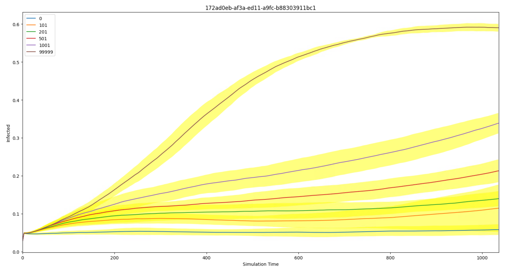
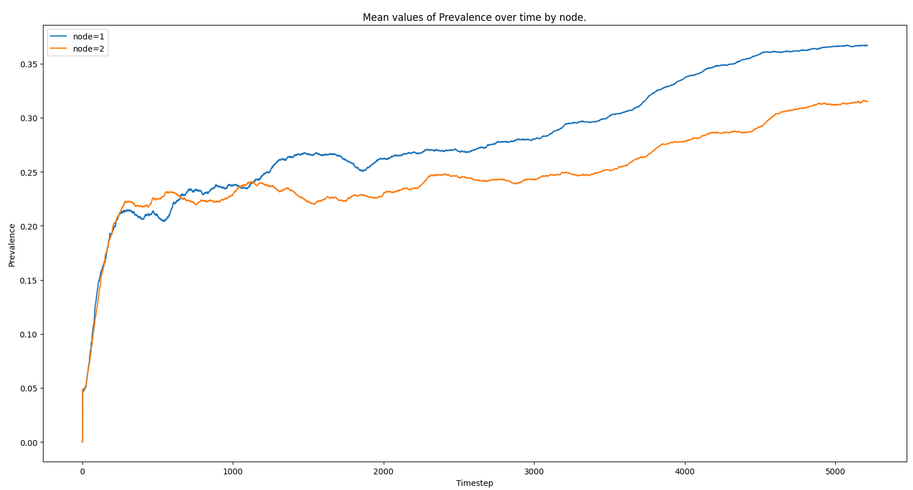
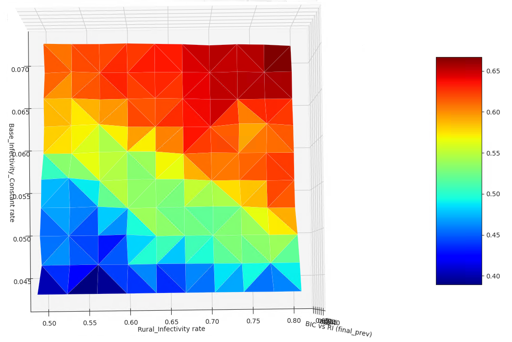

# Plotters

The emod- package has various built-in plotting utilities. We expect you have your own favorite tools and scripts but these should help you at least get started and also discover what output files/reports exist and what they contain.

### Plot mean and spread of aggregate output (InsetChart.json) for an experiment

This script works on a set of InsetChart.json files, which are sometimes known as the Default Report.

This script expects the InsetChart.json files for an experiment to be downloaded and present locally in the following structure:

```
├── experiment_id
│   ├── sim_id_1
│   │   └── InsetChart.json
│   ├── sim_id_2
│   │   └── InsetChart.json
│   ├── sim_id_3
│   │   └── InsetChart.json
│   ├── sim_id_4
│   │   └── InsetChart.json
etc.
```

It also expects the <experiment_id>/results.db file to exist. This is created by calling `emodpy.emod_task.EMOD_Task.cache_experiment_metadata_in_sql`

You can plot one channel at a time. You can specify the experiment id, but if you don't it will try to find it from a local file called COMPS_ID.

If you don't specify a (COMPS) tag, it plots the mean and spread (1 std-dev) of all the sims.
If you specify a tag as '<key>=<value>', it will plot the mean and spread of all the sims with that tag match. Replace <key> with an actual key of course, and same for value.
If you specify the tag as '<key>=SWEEP', it will look for all the values of that key and plot the mean and spread for each of them on the same plot.

**Script usage**

`emod_api.channelreports.plot_icj_means`
```
import emod_api.channelreports.plot_icj_means as plotter
data = plotter.collect( "df26ed6c-a33e-ed1-a9fc-b88303911bc1", tag="iv_cost=SWEEP" )
plotter.display( data )
```

**Command-line usage**
```
python -m emod_api.channelreports.plot_icj_means [-h] [-c CHANNEL] [-e EXPERIMENT_ID] [-t TAG]
```
optional arguments:
: `-h, --help` show this help message and exit
: `-c CHANNEL, --channel CHANNEL` channel(s) to display [Infected]
: `-e EXPERIMENT_ID, --experiment_id EXPERIMENT_ID` experiment id to plot, data assumed to be local
: `-t TAG, --tag TAG` key=value tag constraint



### Plot mean spatial reports for an experiment

This script reads and plots downloaded Spatial Report files from an experiment. It assumes the files are locally present and structured similarly to plot_icj_means.

**Script usage**

`emod_api.spatialreports.plot_spat_means`
```
import emod_api.spatialreports.plot_spat_means as plotter
plotter.plot( "eedf7b5a-3b17-ed11-a9fb-b88303911bc1" )
```

**Command-line usage**
```
python -m emod_api.spatialreports.plot_spat_means [-h] [-c CHANNEL] [-e EXPERIMENT_ID] [-t TAG]
```
optional arguments:
: `-h, --help` show this help message and exit
: `-c CHANNEL, --channel CHANNEL` channel(s) to display [Infected]
: `-e EXPERIMENT_ID, --experiment_id EXPERIMENT_ID` experiment id to plot, data assumed to be local
: `-t TAG, --tag TAG` key=value tag constraint



### Plot property report for a simulation

This script accepts a single PropertyReport.json file as input. Note that this is the only script in this group that accepts a single simulation output file as input (vs. a set of files from an experiment). Unlike InsetChart.json files which have a single aggregated time series per channel, Property Report files are massively disaggregated by design and so are much easier to use with some tooling like this script.

**Command-line usage**
```
python -m emod_api.channelreports.plot_prop_report.py [-h] [-c channelName] [-p PRIMARY] [-n] [-b BY] [-o] [-s] [-m] [-v] [--no-legend] [-l] [filename]
```
positional arguments:
: `filename` property report filename [PropertyReport.json]
optional arguments:
: `-h, --help` show this help message and exit
: `-c channelName, --channel channelName` channel(s) to display [Infected]
: `-p PRIMARY, --primary PRIMARY` Primary IP under which to roll up other IP keys and values
: `-n, --normalize` plot channel(s) normalized by statistical population
: `-b BY, --by BY` Channel for normalization ['Statistical Population']
: `-o, --overlay` overlay pools of the same channel
: `-s, --save` save figure to disk
: `-m, --matrix` plot matrix for all properties
: `-v, --verbose` be chatty
: `--no-legend` hide legend
: `-l, --list` List channels and IP keys found in the report. No plotting is performed with this option.


### Visualize multidimensional sweep outputs

This script reads and plots colormaps of custom output data from an 2-dimensional sweep. It assumes the files are local similarly to plot_icj_means.

**Script usage**
`emod_api.multidim_plotter`
```
output_for_analysis=["final_prev"]
from emodpy.emod_task import EMODTask as task
task.get_file_from_comps( experiment_id, output_for_analysis )
task.cache_experiment_metadata_in_sql( experiment_id, optional_data_files=output_for_analysis )

import matplotlib.pyplot as plt
import emod_api.multidim_plotter as twoplotter

for output in output_for_analysis:
    twoplotter.plot_from_sql( "Base_Infectivity_Constant", "Rural_Infectivity", output=output, label=output )
```

Example Explained:

* final_prev is the name of an output file produced by the dtk_post_process.py script. 
* get_file_from_comps is used to get all the copies of 'final_prev' for the entire experiment from COMPS downloaded locally.
* cache_experiment_metadata_in_sql retrieves the tag info from COMPS for the experiment and creates a local sqlite db (called 'results.db', in the latest experiment directory). It will include a column with the value in 'final_prev' for each simulation.
* The function 'plot_from_sql' in multidim_plotter then displays a 3D plot (displayed as a 2D colourmap by default) for the two tag axes specified. The color represents the corresponding value of 'final_prev' in this example.

**Command-line usage**
```
python -m emod_api.multidim_plotter [-h] [-x XTAG] [-y YTAG] [-o OUTPUT] [-t TITLE] [-e EXPERIMENT_ID]
```
optional arguments:
: `-h, --help` show this help message and exit
: `-x XTAG, --xtag XTAG` X tag (must be in db)
: `-y YTAG, --ytag YTAG` Y tag (must be in db)
: `-o OUTPUT, --output OUTPUT` Single value output file
: '-t TITLE, --title TITLE` Graph title
: '-e EXPERIMENT_ID, --experiment_id EXPERIMENT_ID` experiment id to plot, uses latest_experiment folder if omitted (not used yet)

**Sample Output**

